# ThingsBoard Gateway Simulator

## 📋 Giới thiệu

Đây là simulator cho ThingsBoard Gateway kết nối qua MQTT, hỗ trợ các tính năng:
- **Gateway device** (GWPS_105) với các RPC methods riêng
- **Virtual lock devices** (LOCK_105) có thể nhận RPC từ ThingsBoard
- **Telemetry & Attributes** tự động gửi định kỳ
- **Gateway MQTT API** chuẩn theo ThingsBoard documentation

## 🏗️ Kiến trúc hệ thống

```
Postman → ThingsBoard API → Gateway RPC → Virtual Lock → Response ngược lại
```

## 🔧 Cấu hình

### Broker Settings
```python
BROKERS = {
    "thingsboard": {
        "host": "192.168.44.134",
        "port": 1883,
        "access_token": "5xaFxOYnnmaLuQeSQfwA",
        # ... các topics
    }
}
```

### Virtual Devices
```python
virtual_lock_devices = {

}
```

## 📡 Luồng tin nhắn RPC

### 🔄 Sequence Diagram

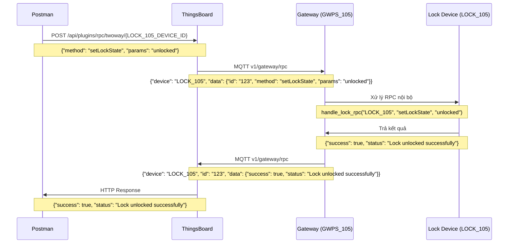

## 🧪 Hướng dẫn Test với Postman

### Bước 1: Lấy JWT Token
**Request:**
```
POST http://192.168.44.134:8080/api/auth/login
Content-Type: application/json

{
  "username": "tenant@thingsboard.org",
  "password": "tenant"
}
```

**Response:**
```json
{
  "token": "eyJhbGciOiJIUzUxMiJ9...",
  "refreshToken": "eyJhbGciOiJIUzUxMiJ9..."
}
```

### Bước 2: Lấy Device ID của LOCK_105
**Request:**
```
GET http://192.168.44.134:8080/api/tenant/devices?deviceName=LOCK_105
Header: X-Authorization: Bearer {JWT_TOKEN}
```

**Response:**
```json
{
  "id": {
    "entityType": "DEVICE",
    "id": "d8a3c7c0-1234-5678-90ab-cdef12345678"
  },
  "name": "LOCK_105"
}
```

### Bước 3: Gửi RPC đến Lock Device
**Request:**
```
POST http://192.168.44.134:8080/api/plugins/rpc/twoway/{LOCK_105_DEVICE_ID}
Headers: 
  Content-Type: application/json
  X-Authorization: Bearer {JWT_TOKEN}

Body:
```

#### 📋 Các RPC Methods có thể test:

**1. setLockState - Thay đổi trạng thái khóa**
```json
{
  "method": "setLockState",
  "params": "unlocked"
}
```

**2. getLockState - Lấy trạng thái hiện tại**
```json
{
  "method": "getLockState", 
  "params": {}
}
```

**3. getLockInfo - Lấy thông tin đầy đủ**
```json
{
  "method": "getLockInfo",
  "params": {}
}
```

### Bước 4: Kiểm tra Response

**Response thành công:**
```json
{
  "success": true,
  "status": "Lock unlocked successfully"
}
```

**Response lỗi:**
```json
{
  "success": false,
  "error": "Invalid state"
}
```

## 🔍 Logging và Debug

### Các topics MQTT được subscribe:
- `v1/devices/me/rpc/request/+` - RPC cho gateway device
- `v1/gateway/rpc` - RPC cho các devices qua gateway

### Log mẫu khi nhận RPC:
```
📨 Nhận message từ topic: v1/gateway/rpc
📦 Payload: {
  "device": "LOCK_105",
  "data": {
    "id": "19",
    "method": "setLockState",
    "params": "unlocked"
  }
}

🎯 Xử lý RPC cho LOCK_105
✅ Lock LOCK_105 changed: locked → unlocked
✅ RPC response từ LOCK_105: {'success': True, 'status': 'Lock unlocked successfully'}
```

## ⚙️ Các tính năng khác

### Telemetry tự động
- Battery level giảm dần theo thời gian
- RSSI signal thay đổi ngẫu nhiên
- Gửi telemetry mỗi 30 giây

### Gateway Device RPC
Các methods cho gateway device (GWPS_105):
- `setPowerSaverState` - Bật/tắt power saver
- `getPowerSaverState` - Lấy trạng thái power saver
- `setPowerSaverConfig` - Cấu hình power saver
- `getPowerSaverConfig` - Lấy cấu hình power saver

### Attributes
Các attributes được đồng bộ:
- Device name, location, model
- Firmware version, device type
- Connection status

## 🚀 Chạy simulator

```bash
python gateway_simulator.py
```

Simulator sẽ:
1. Kết nối MQTT đến ThingsBoard
2. Kết nối virtual lock devices
3. Gửi attributes và telemetry ban đầu
4. Sẵn sàng nhận RPC từ ThingsBoard

## 🐛 Xử lý lỗi thường gặp

### Lỗi kết nối MQTT
- Kiểm tra IP và port của ThingsBoard MQTT broker
- Kiểm tra access token của gateway device

### RPC không hoạt động
- Đảm bảo gửi RPC đến đúng LOCK_105 device ID
- Kiểm tra JWT token còn hiệu lực
- Xem log simulator để debug

### Device không xuất hiện trên ThingsBoard
- Kiểm tra gateway có kết nối thành công
- Đảm bảo virtual devices được gửi connect message

## 📞 Hỗ trợ

Khi gặp vấn đề, kiểm tra:
1. Log của simulator để xem chi tiết lỗi
2. ThingsBoard Device Telemetry để xem dữ liệu
3. ThingsBoard Rule Chains để debug luồng RPC

---
**Note:** Simulator này mô phỏng hoạt động của ThingsBoard Gateway thực tế, phù hợp cho testing và development.

# ThingsBoard Gateway Simulator - Sequence Diagrams

## 📋 Danh sách các Sequence Diagrams

### 1. RPC to Lock Device
### 2. Gateway Device Telemetry
### 3. Gateway Device Attributes
### 4. Lock Device Telemetry
### 5. Lock Device Attributes
### 6. Gateway Device RPC
### 7. Periodic Telemetry

## 🔄 1. RPC to Lock Device Sequence

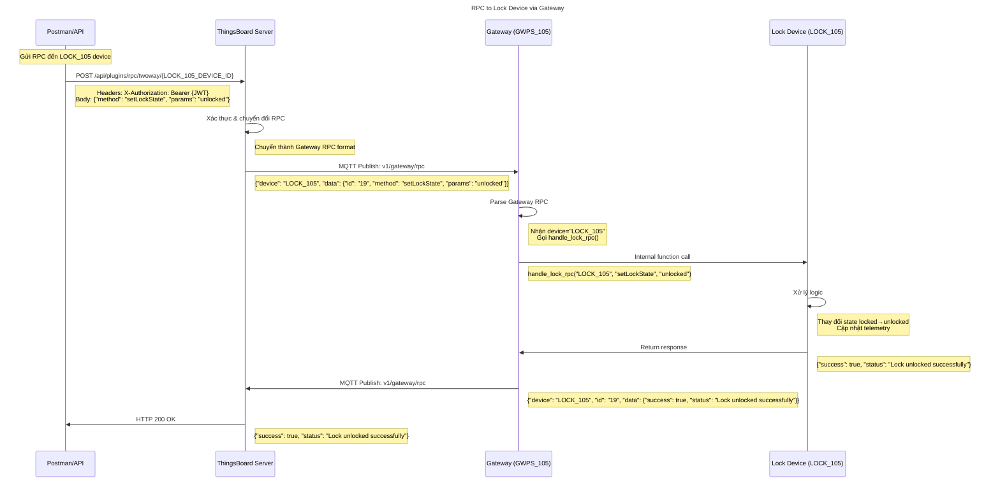

## 📊 2. Gateway Device Telemetry Sequence

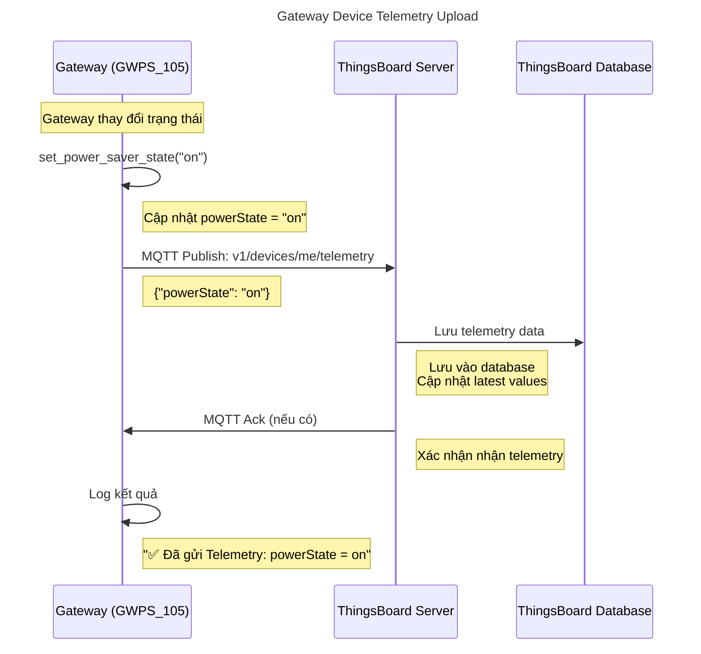

## 🏷️ 3. Gateway Device Attributes Sequence

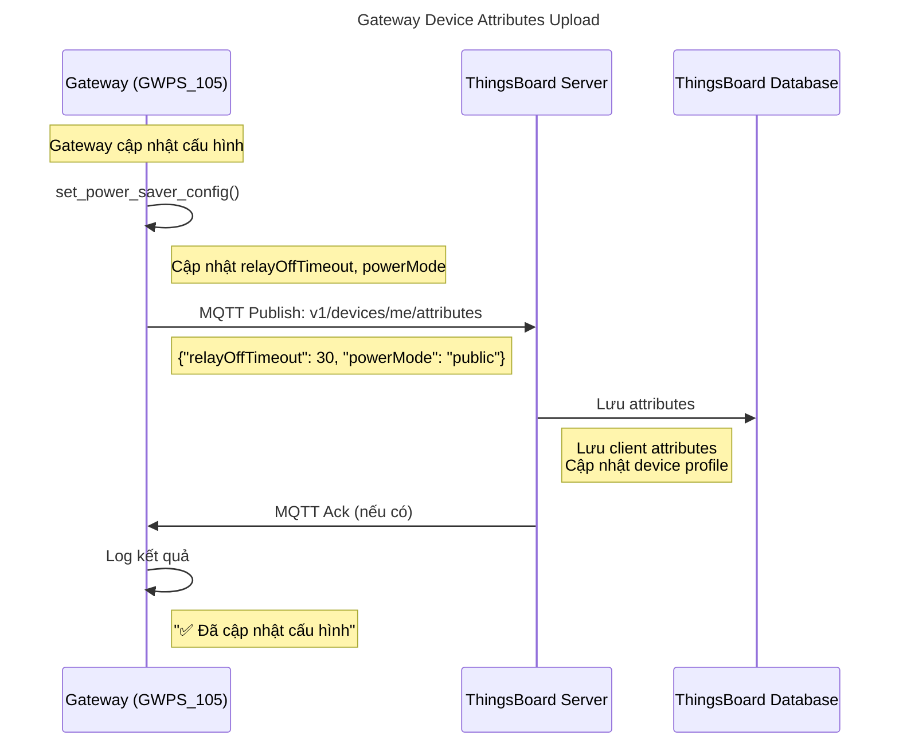

## 🔐 4. Lock Device Telemetry Sequence

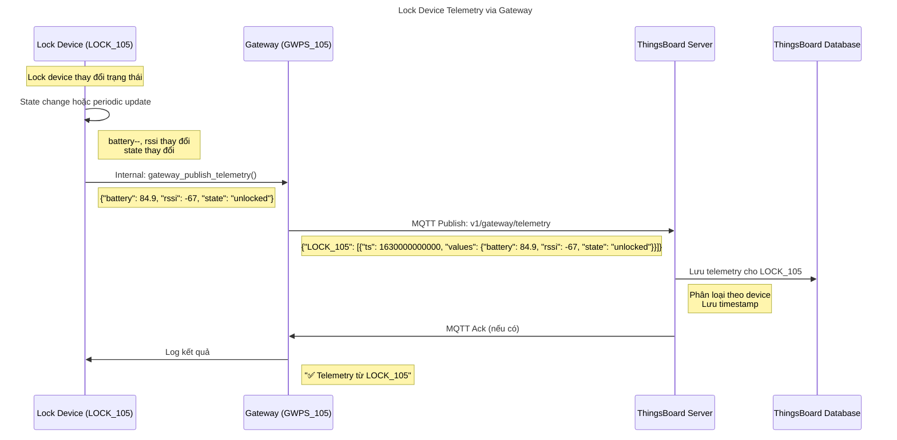

## 📝 5. Lock Device Attributes Sequence

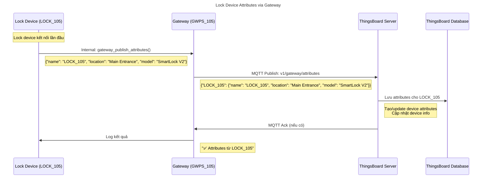

## ⚡ 6. Gateway Device RPC Sequence

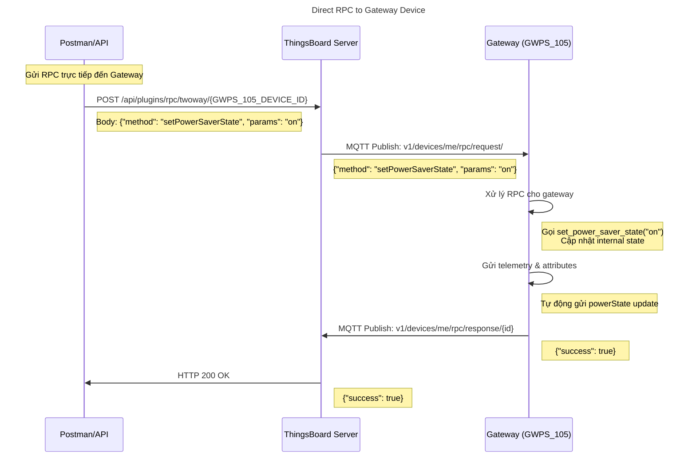

## 🔄 7. Periodic Telemetry Sequence

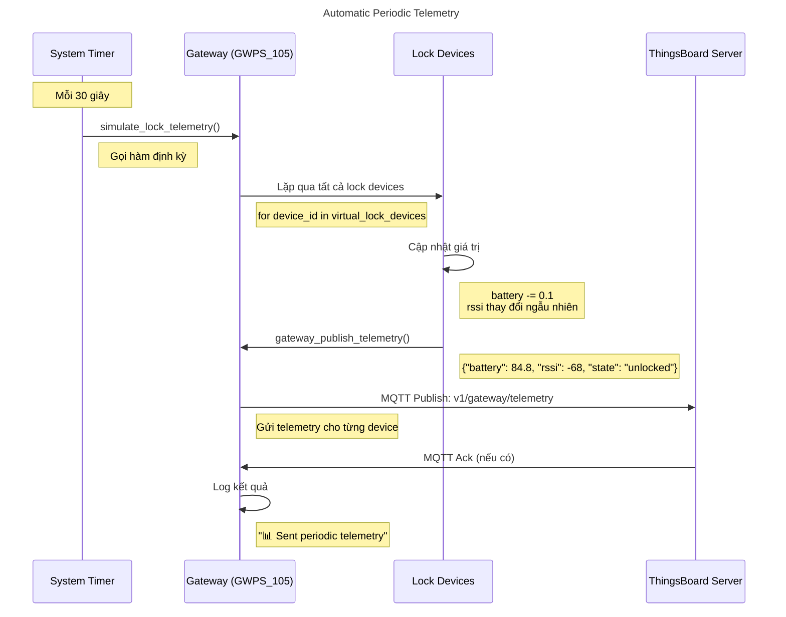

## 🔌 8. Device Connection Sequence

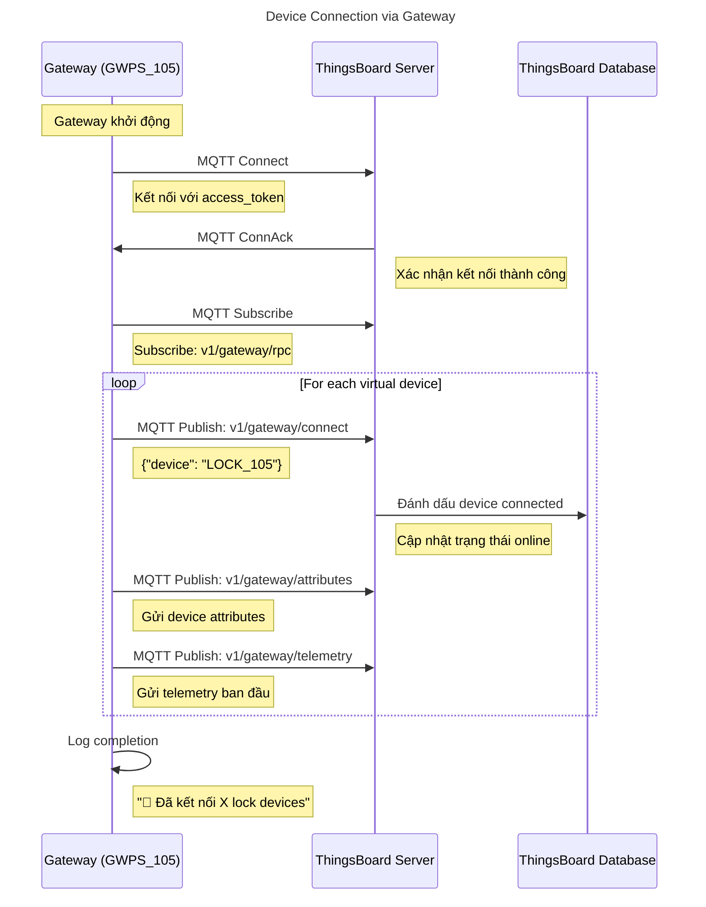

## 🛠️ 9. Error Handling Sequence

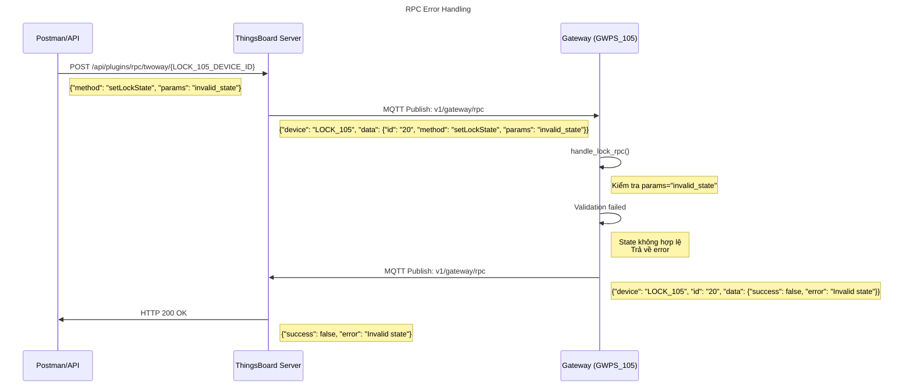

## 📈 10. Multi-Device RPC Sequence

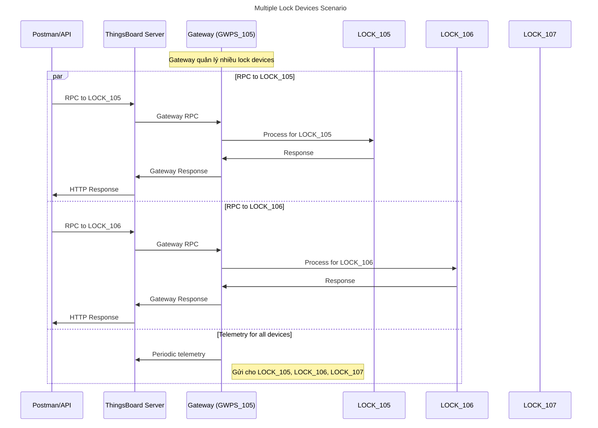

Các sequence diagrams này cho thấy toàn bộ luồng hoạt động có thể test được với simulator, từ RPC đơn giản đến các scenario phức tạp với nhiều devices.